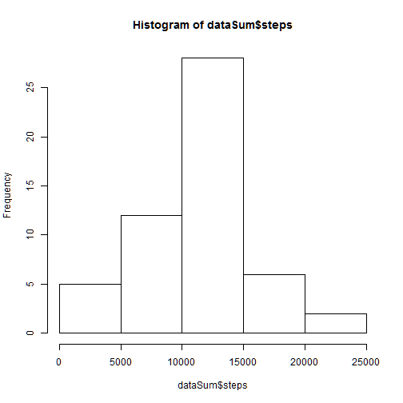
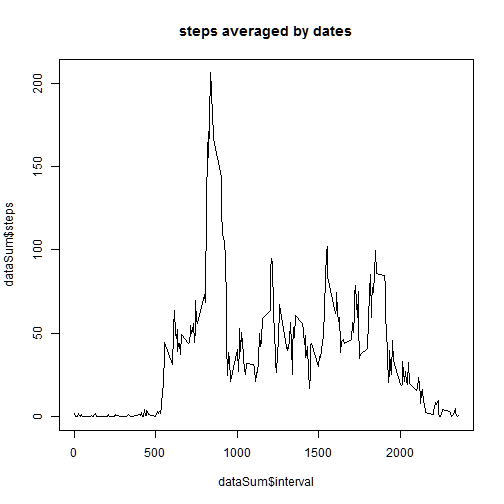

# Reproducible Research: Peer Assessment 1


## Loading and preprocessing the data


```r
conn="activity.zip"
data <- read.csv(unz(conn, "activity.csv"), header=TRUE ,sep=",")
# Dates as dates
data$date <- as.Date(data$date, "%Y-%m-%d")
dataSum<-aggregate(steps~date, data=data, sum)
hist(dataSum$steps)
```

 

## What is mean total number of steps taken per day?

Steps mean

```r
mean(dataSum$steps)
```

```
## [1] 10766
```

Steps median


```r
median(dataSum$steps)
```

```
## [1] 10765
```


## What is the average daily activity pattern?


```r
dataSum<-aggregate(steps~interval, data=data, mean)
averageAllDays<-mean(data$steps, na.rm=T)

plot( dataSum$interval,dataSum$steps, type="l")
title("steps averaged by dates")
```

 

interval with largest averaged steps 

```r
dataSum$interval[which.?max(dataSum$steps)]
```

```
## Error: no documentation of type 'which.' and topic 'max(dataSum$steps)'
## (or error in processing help)
```
## Imputing missing values
Number of NAs

```r
sum(is.na(data))
```

```
## [1] 2304
```


## Are there differences in activity patterns between weekdays and weekends?
